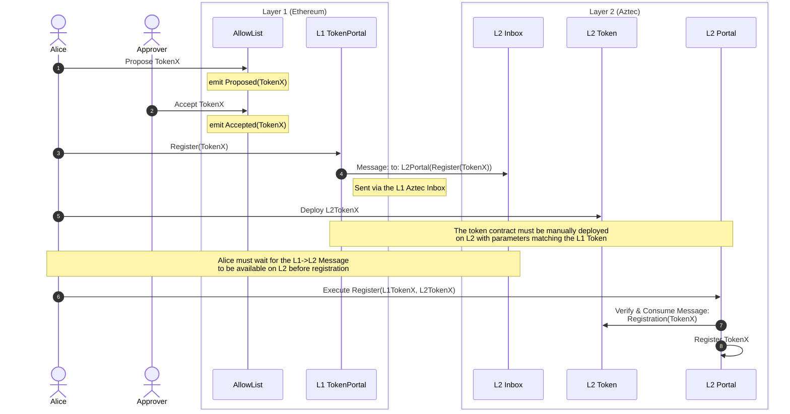
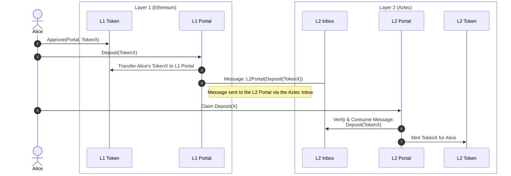

# Turnstile Contracts

This is the Turnstile contract monorepo containing L1 and L2 contracts for the Turnstile Portal.

## Repository Structure

- [l1/](l1): L1 contracts
- [aztec/](aztec): Aztec/L2 contracts
- [packages/](packages): Typescript packages containing contract artifacts, utilities, and the API stack
  - [packages/api-service](packages/api-service): Fastify REST API service
  - [packages/collector](packages/collector): L1/L2 blockchain data collectors
  - [packages/api-common](packages/api-common): Shared database schema, migrations, and helpers
  - [packages/api-client](packages/api-client): Type-safe API client bindings
- [examples/](examples): Example scripts for interacting with Turnstile (API samples live under [examples/turnstile-api](examples/turnstile-api))
- [scripts/](scripts): Scripts for deploying and interacting with the contracts
- [hooks/](hooks): Git hooks for the repository
- [docker/turnstile-sandbox](docker/turnstile-sandbox): Docker config for the Turnstile Sandbox
- [docker/turnstile-api](docker/turnstile-api): Dockerfile and Compose setup for the API service and collector

## Development Environment

The recommended development environment is to use VS Code with the devcontainer configuration
in this repository, otherwise you'll need to install the following:

- [Foundry](https://book.getfoundry.sh/)
- [Aztec Sandbox](https://docs.aztec.network/guides/developer_guides/getting_started/quickstart#install-the-sandbox)
- [pnpm](https://pnpm.io)

### Devcontainer

#### Ports Forwarded

- `8080`: [Aztec PXE Service](https://docs.aztec.network/aztec/concepts/pxe)
- `8545`: Local Ethereum Node [(Anvil)](https://book.getfoundry.sh/anvil/)

## Turnstile Sandbox

The Turnstile Sandbox is a modified version of the
[Aztec Sandbox](https://docs.aztec.network/guides/developer_guides/getting_started/quickstart#install-the-sandbox)
that includes pre-deployed Turnstile contracts and test tokens. It is intended for use in local development.

See [docker/turnstile-sandbox](docker/turnstile-sandbox) for more information.

## Development

Before you start, run:

```bash
make init
```

### Building

**Everything:**

```bash
make build
```

**Contract Artifacts:**

These commands update the contract artifacts under [packages/](packages):

```bash
make artifacts
# or
make l1-artifacts
make aztec-artifacts
```

**Node Packages:**

```bash
just build-packages
```

### Unit Tests

```bash
make test
```

### REPL environment

```bash
pnpm repl
```

### Running the sandbox within the devcontainer

```bash
make sandbox
```

This starts up the [Aztec Sandbox](https://docs.aztec.network/reference/developer_references/sandbox_reference)
and deploys the L1 and L2 contracts to it along with some test tokens. The addresses of deployed contracts will
be stored in the `sandbox-data.json` file.

### L1 DEV Accounts

We use the default anvil accounts for manual testing.
They are derived from the mnemonic `test test test test test test test test test test test junk` with
derivation paths `m/44'/60'/0'/0/0` to `m/44'/60'/0'/0/9`.

The purpose, address, and private key of each account are as follows:

| Purpose            | Derivation Path | L1 Address                                   | Private Key                                                          |
| ------------------ | --------------- | -------------------------------------------- | -------------------------------------------------------------------- |
| bridge user        | `0`             | `0xf39Fd6e51aad88F6F4ce6aB8827279cffFb92266` | `0xac0974bec39a17e36ba4a6b4d238ff944bacb478cbed5efcae784d7bf4f2ff80` |
| bridge user        | `1`             | `0x70997970C51812dc3A010C7d01b50e0d17dc79C8` | `0x59c6995e998f97a5a0044966f0945389dc9e86dae88c7a8412f4603b6b78690d` |
| bridge user        | `2`             | `0x3C44CdDdB6a900fa2b585dd299e03d12FA4293BC` | `0x5de4111afa1a4b94908f83103eb1f1706367c2e68ca870fc3fb9a804cdab365a` |
| bridge user        | `3`             | `0x15d34AAf54267DB7D7c367839AAf71A00a2C6A65` | `0x7c852118294e51e653712a81e05800f419141751be58f605c371e15141b007a6` |
| Contract Deployer  | `7`             | `0x14dC79964da2C08b23698B3D3cc7Ca32193d9955` | `0x4bbbf85ce3377467afe5d46f804f221813b2bb87f24d81f60f1fcdbf7cbf4356` |
| AllowList Admin    | `8`             | `0x23618e81E3f5cdF7f54C3d65f7FBc0aBf5B21E8f` | `0xdbda1821b80551c9d65939329250298aa3472ba22feea921c0cf5d620ea67b97` |
| AllowList Approver | `9`             | `0xa0Ee7A142d267C1f36714E4a8F75612F20a79720` | `0x2a871d0798f97d79848a013d4936a73bf4cc922c825d33c1cf7073dff6d409c6` |

## Bridging Flows

### Token Registration

The Token Registration flow is as follows:



1. Alice proposes a token address for the allow list.
2. The proposed address can be accepted or rejected by the allow list approver.
3. Once accepted, the proposed address must be registered with both the L1 and L2 Portals.
4. The L1 Token Portal sends a registration message to the L2 Portal via the Aztec Inbox.
5. Alice must deploy the an L2 token contract with the same parameters as the L1 token contract and with the L2 Portal as the minter.
6. After the L2 contract is deployed, Alice waits for the registration message to be available on L2, then calls the `register` function on the L2 Portal.
7. The L2 Portal verifies the token contract matches the registration message and consumes the registration message.
8. The L2 Portal registers the L2 token contract as the paired token for the L1 token contract.

### Deposit

The Deposit flow requires that a token first be registered with the L1 and L2 Portals
following the [Token Registration](#token-registration) flow. Once registered, users
can deposit the token into the L1 Portal, which will then mint the equivalent amount
of the token on the L2 network.

The Deposit flow is as follows:



1. Alice calls the `approve()` function on the L1 Token contract to authorize the L1 Portal to transfer tokens on her behalf.
2. Alice calls the `deposit()` function on the L1 Portal with the token address and amount to deposit.
3. The L1 Portal transfers Alice's tokens to itself.
4. The L1 Portal sends a message to the L2 Portal via the Aztec Rollup Inbox informing it of the deposit.
5. After waiting for the L1->L2 deposit message to be available on L2, Alice calls the `claim()` function on the L2 Portal.
6. The L2 Portal verifies the claim against the L1->L2 deposit message and consumes it.
7. The L2 Portal tells the L2 Token contract to mint the equivalent amount of tokens for Alice.

### Token Withdrawal

```mermaid
sequenceDiagram
    autonumber
    actor Alice
    box Layer 2 (Aztec)
        participant L2P as L2 TokenPortal
        participant L2T as L2 Token
    end
    box Layer 1 (Ethereum)
        participant L1I as L1 Inbox
        participant L1P as L1 Portal
        participant L1T as L1 Token
    end

    Alice->>Alice: Create Authentication Witness<br/> to enable burning L2TokenX
    Alice->>L2P: Submit Authentication Witness to the chain
    Alice->>L2P: Execute Withdraw(L2TokenX)
    L2P->>L2T: Burn Alice's L2TokenX
    L2P->>L1I: Message: L1Portal(Withdraw(L2TokenX))
    note right of L2P: Sent to L1 via the Aztec Outbox
    note over Alice,L1I: Alice must wait for the L2->L1 Message<br/>to be available on L1 before withdrawal
    Alice->>L1P: Claim Withdrawal(L2TokenX)
    L1P->>L1I: Verify & Consume Message:<br/>Withdraw(L2TokenX)
    L1P->>L1T: Transfer tokens to Alice
```



1. Alice creates an authentication witness to enable the L2 Portal to burn tokens on her behalf.
2. Alice publicly submits the authentication witness to the chain.
3. Alice calls the `withdraw` function on the L2 Portal with the token & withdrawal amount.
4. The L2 Portal burns Alice's L2 tokens, using the authentication witness to prove her permission.
5. The L2 Portal sends a message to the L1 Portal via the Aztec Outbox to withdraw the equivalent amount of tokens.
6. Alice waits for the withdrawal message to be available on L1, then calls the `claimWithdrawal` function on the L1 Portal.
7. The L1 Portal verifies and consumes the withdrawal message
8. The L1 Portal transfers the tokens to Alice.

## Releases

1. On GitHub:
   - Go to Actions → "Version and Release" workflow
   - Click "Run workflow"
   - Select version bump type (patch/minor/major)
   - Click "Run workflow"

This will automatically:
1. Bump package versions
2. Create a git tag and GitHub release
3. Publish packages to NPM
4. Build and push Docker images to GitHub Container Registry:
   - `ghcr.io/turnstileportal/turnstile-sandbox-deployer:vX.Y.Z`
   - `ghcr.io/turnstileportal/turnstile-sandbox-deployer:latest`

Note: The Docker image will use the exact NPM package version from the release.

## Notes

- The [Docker-in-Docker Devcontainer Feature](https://github.com/devcontainers/features/tree/main/src/docker-in-docker)
  is used for running the [Aztec Sandbox](https://docs.aztec.network/reference/developer_references/sandbox_reference)
  within the dev container.
- The Aztec Sandbox is installed via [this unofficial devcontainer feature](https://github.com/ClarifiedLabs/devcontainer-features/tree/main/src/aztec-sandbox)
  which may break in the future if the Aztec Sandbox is updated. The Aztec
  Sandbox version specified by the `version` option must match the aztec-packages
  version used by the Turnstile Aztec contracts.
