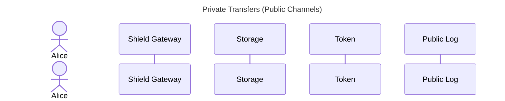

# Turnstile Aztec Contracts

Aztec contracts for the Turnstile Portal.

## Development

### Prerequisites

This project requires the following dependencies, which are included if you use the devcontainer:

- [Aztec Sandbox](https://docs.aztec.network/guides/developer_guides/getting_started/quickstart#install-the-sandbox)
- [pnpm](https://pnpm.io)

### Building

```bash
# compile the contracts
make build
```

### Testing

```bash
make test
```

### Transaction Flows



