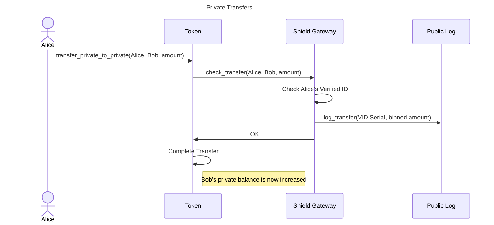

# Turnstile Aztec Contracts

Aztec contracts for the Turnstile Portal.

## Overview

The Turnstile Aztec contracts enable bridging of ERC20 tokens from Ethereum L1 to Aztec L2.
The tokens on Aztec are compliance-friendly, meaning that private transfers of the tokens
require the sender to have a Verified ID (VID) issued by a trusted issuer.

All Aztec token contracts have a registered Shield Gateway contract that is responsible for
checking that the private transfer follow the rules set by the token & Shield Gateway.

## General Turnstile Portal Rules

1. All public transactions are entirely permissionless / always allowed.
2. Bridging tokens between L1 and L2 is entirely permissionless and must be done as a public
   transaction.
3. Shielding a balance (i.e. converting a public balance to a private balance) is entirely
   permissionless and must be done as a public transaction.
4. Unshielding a balance (i.e. converting a private balance to a public balance) is entirely
   permissionless and must be done as a public transaction.
5. Private transfers of tokens require the sender to have a VID issued by a trusted issuer.
6. The Shield Gateway can restrict private transfers based on the information contained in
   the VID of the sender. The Shield Gateway cannot restrict transfers based on the VID of
   the recipient.
7. The Shield Gateway can log information about private transfers to a public log for
    regulatory or reporting purposes. The information logged does not publicly reveal the
    exact amount being transferred or the identity of the sender or recipient.

This means that your tokens cannot be locked in the Aztec L2 behind a Shield Gateway check:
Anyone can withdraw tokens from L2 to L1 without restrictions.
This includes withdrawing private balances, which can be converted to public balances on L2
and then bridge to L1 without any checks/restrictions.

## Private Transaction Flows

In the initial version of the Turnstile Portal, the Shield Gateway checks that the sender
has a valid VID that asserts information about the sender (e.g. country of residence and
if they are on a sanctions list) and uses that information to determine if the transfer
is allowed. The Shield Gateway also logs a binned version of the transfer amount to a public
log along with the VID serial number of the sender. The binned amount is a coarse
representation of the amount that should be sufficient for reporting purposes but does not
reveal the exact amount being transferred. The VID serial number is tied to a specific VID
issuer that can be contacted by law enforcement or regulators if needed.

